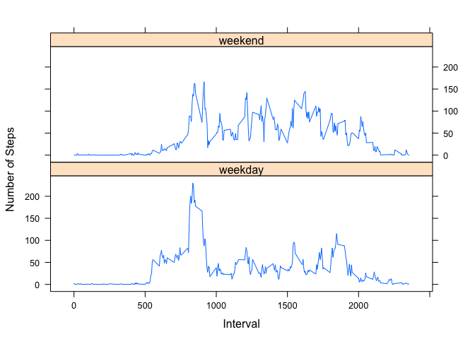

# Reproducible Research: Peer Assessment 1
The following is an analysis of the data from a personal activity monitoring device. This analysis was conducted as a project for the Reproducible Research class offered through Coursera. The data was forked from the github repository <https://github.com/rdpeng/RepData_PeerAssessment1>, and the analysis was guided by specific questions that can be found in the README

## Loading and preprocessing the data
1. *Load the data (i.e. read.csv())*

```r
# create a data frame from the read file, unless this step has 
# already been done
if (!exists("activitydata")){
        file<-unzip("activity.zip")
        activitydata<-read.csv(file = file, header = T, 
                               sep = ",", na.strings="NA")
}
```
The activitydata data frame spans 1/10/2012 through 30/11/2012.   

## What is mean total number of steps taken per day?  
1. *Make a histogram of the total number of steps taken each day*  


```r
# split the step record by day
allStepsByDay<-split(activitydata$steps, activitydata$date)
# sum all steps in each day
stepSumByDay<-lapply(X = allStepsByDay, FUN = sum) 
# extract all values from list
stepSumByDay<-matrix(unlist(stepSumByDay),ncol=1) 
# plot histogram of extracted values
hist(stepSumByDay, xlab = "total number of steps recorded each day", 
     main = "Histogram of total recorded steps between 1/10/2012 and 30/11/2012")
```

 

2. *Calculate and report the mean and median total number of steps taken per day*  

```r
#for each day, calculate the mean of the steps taken
stepMeans<-lapply(X = allStepsByDay, function(x) mean(x, na.rm = T))
```
On any day, there are many five-minute intervals for which the number of steps recorded is 0. To accurately find the median number of steps taken, these 0s must first be discarded. 

```r
# copy activitydata to nonZeroData and change all 0 values in nonZeroData$steps to NAs
nonZeroStepData<-activitydata
nonZeroStepData$steps[nonZeroStepData$steps==0]<-NA
# split the processed step record by day
nonZeroStepsByDay<-split(nonZeroStepData$steps, nonZeroStepData$date)
# Calculate the median for each day
stepMedians<-lapply(X = nonZeroStepsByDay, function(x) median(x, na.rm = T))
```

The following table presents the mean and median number of steps taken for each day

```r
meanAndMeds<-as.data.frame(cbind(stepMeans, stepMedians))
list(HEAD = head(meanAndMeds,5), TAIL = tail(meanAndMeds,5))
```

```
## $HEAD
##            stepMeans stepMedians
## 2012-10-01       NaN          NA
## 2012-10-02    0.4375          63
## 2012-10-03     39.42          61
## 2012-10-04     42.07        56.5
## 2012-10-05     46.16          66
## 
## $TAIL
##            stepMeans stepMedians
## 2012-11-26     38.76          53
## 2012-11-27     47.38          57
## 2012-11-28     35.36          70
## 2012-11-29     24.47        44.5
## 2012-11-30       NaN          NA
```


## What is the average daily activity pattern?

1. *Make a time series plot (i.e. type = "l") of the 5-minute interval (x-axis) and the average number of steps taken, averaged across all days (y-axis)*

```r
# obtain the step record for each interval
stepsByInterval<-split(activitydata$steps, activitydata$interval)
# calculate the average number of steps per interval
avStepsByInterval<-lapply(stepsByInterval, function(x) mean(x, na.rm = T))
# create time-series plot
plot(x = unique(activitydata$interval),y = avStepsByInterval, type="l", xlab = "Five Minute Intervals", ylab = "Average number of steps taken", main = "Time series plot of interval vs average steps")
```

 

2. *Which 5-minute interval, on average across all the days in the dataset, contains the maximum number of steps?*


```r
# get the values in the list avStepsByInterval 
avStepsByInterval<-matrix(unlist(avStepsByInterval),ncol=1)
# find the max of all the averages
maxAv<-max(avStepsByInterval)
# locate the index of this max value
indMax<-which(avStepsByInterval %in% maxAv)
# use the index to find the interval
lower<-unique(activitydata$interval)[indMax]
upper<-lower+5
paste("The 5 minute interval containing the maximum number of steps is",
      lower, "(to", upper, 
      "), and the maximum average number of steps is", maxAv, sep = " ")
```

```
## [1] "The 5 minute interval containing the maximum number of steps is 835 (to 840 ), and the maximum average number of steps is 206.169811320755"
```

## Imputing missing values
1. *Calculate and report the total number of missing values in the dataset (i.e. the total number of rows with NAs)*  

NAs only occur in steps, with all other data being automatically recorded by the device. Thus, the total number of rows with NAs is given by

```r
sum(is.na(activitydata$steps))
```

```
## [1] 2304
```
2. *Devise a strategy for filling in all of the missing values in the dataset. *  

Recalling the heuristics that  
-the median is most useful for describing the center of skewed distributions  
-the mean is most useful for describing symmetric distributions  
-the ratio of the mean to the median is a measure of skewness, i,e,: when mean/median is approximately equal to 1, the distribution is symmetric; else, it is left- or right-skewed

the following imputation strategy is proposed:  
1. in each interval, use the ratio of mean to median to decide the skewness of the distribution of steps in that interval  
2. replace NAs by the mean value of the interval if the ratio of mean to median in that interval is between 0.9 and 1.1  
3. otherwise, replace NAs with the median value of the interval, unless the median value is itself NA, in which case we use the mean. 


```r
# split nonZeroStepData (=activity data with 0s replaced by NAs) by interval
nonZeroStepsByInterval<-split(nonZeroStepData$steps, nonZeroStepData$interval)
# Calculate the median for each interval
intervalStepMedians<-lapply(X = nonZeroStepsByInterval, function(x) median(x, na.rm = T))
#calculate the ratio of mean to median
intervalStepMedians<-matrix(unlist(intervalStepMedians), ncol = 1)
ratios<-as.vector(avStepsByInterval/intervalStepMedians)
# replace NAs using the imputation procedure
for (i in (1:length(ratios))){
        if (is.na(ratios[i])){
                stepsByInterval[[i]][which(is.na(stepsByInterval[[i]]) %in% T)]<-avStepsByInterval[i]
        }else if(ratios[i] < 0.9){ 
                stepsByInterval[[i]][which(is.na(stepsByInterval[[i]]) %in% T)]<-avStepsByInterval[i]
        }else if (ratios[i] > 1.1){
                stepsByInterval[[i]][which(is.na(stepsByInterval[[i]]) %in% T)]<-avStepsByInterval[i]
        }else {
             stepsByInterval[[i]][which(is.na(stepsByInterval[[i]]) %in% T)]<-intervalStepMedians[i]
        }
}
```

3. *Create a new dataset that is equal to the original dataset but with the missing data filled in.*

```r
allsteps<-unsplit(stepsByInterval, activitydata$interval)
steps<-activitydata$steps
dates<-activitydata$date
interval<-activitydata$interval
newdf<-data.frame(allsteps, dates, interval)
```
4. *Make a histogram of the total number of steps taken each day and calculate and report the mean and median total number of steps taken per day*  

Create histogram

```r
# split the step record by day
newAllStepsByDay<-split(newdf$allsteps, newdf$date)
# sum all steps in each day
newStepSumByDay<-lapply(X = newAllStepsByDay, FUN = sum) 
# extract all values from list
newTotalStepsByDay<-matrix(unlist(newStepSumByDay),ncol=1) 
# plot histogram of extracted values
hist(newTotalStepsByDay, xlab = "total number of steps recorded each day",
     main = "Total recorded steps between 1/10/2012 and 30/11/2012 (NA replaced)")
```

 

Calculate mean and median after imputation

```r
# compute means as before
IMallStepsByDay<-split(newdf$allsteps, newdf$dates)
IMstepMeans<-lapply(X = IMallStepsByDay, function(x) mean(x, na.rm = T))

# compute medians as before
nznewdf<-newdf
nznewdf$allsteps[floor(nznewdf$allsteps)==0]<-NA
IMnzStepData<-split(nznewdf$allsteps, nznewdf$dates)
IMstepMedians<-lapply(IMnzStepData, function(x) median(x, na.rm = T))

# display with unimputed means and medians
meanAndMeds2<-as.data.frame(cbind(stepMeans, IMstepMeans, stepMedians, IMstepMedians))
list(HEAD = head(meanAndMeds2,8), TAIL = tail(meanAndMeds2,5))
```

```
## $HEAD
##            stepMeans IMstepMeans stepMedians IMstepMedians
## 2012-10-01       NaN       37.52          NA         42.38
## 2012-10-02    0.4375      0.4375          63            63
## 2012-10-03     39.42       39.42          61            61
## 2012-10-04     42.07       42.07        56.5          56.5
## 2012-10-05     46.16       46.16          66            66
## 2012-10-06     53.54       53.54          67            67
## 2012-10-07     38.25       38.25        52.5          52.5
## 2012-10-08       NaN       37.52          NA         42.38
## 
## $TAIL
##            stepMeans IMstepMeans stepMedians IMstepMedians
## 2012-11-26     38.76       38.76          53            53
## 2012-11-27     47.38       47.38          57            57
## 2012-11-28     35.36       35.36          70            70
## 2012-11-29     24.47       24.47        44.5          44.5
## 2012-11-30       NaN       37.52          NA         42.38
```
*Do these values differ from the estimates from the first part of the assignment?*  
There are no differences in the means and medians of the imputed and unimputed data, with the exception of the NAs/NaNs of the latter being replaced. 

*What is the impact of imputing missing data on the estimates of the total daily number of steps?*

```r
unimputed<-sum(stepSumByDay, na.rm = T)
imputed<-sum(newTotalStepsByDay, na.rm = T)
absdiff<-abs(unimputed-imputed)
data.frame(unimputed, imputed, absdiff)
```

```
##   unimputed imputed absdiff
## 1    570608  657062   86454
```
Imputing missing data increases the total number of daily steps by 86454. This is reflected in the higher frequencies of the histogram of the imputed data: 

```r
par(mfrow=c(1,2))
hist(stepSumByDay, xlab = "total number of steps recorded each day", main = "Unimputed")
hist(newTotalStepsByDay, xlab = "total number of steps recorded each day", main = "Imputed")
```

 
## Are there differences in activity patterns between weekdays and weekends?  
1. *Create a new factor variable in the dataset with two levels – “weekday” and “weekend” indicating whether a given date is a weekday or weekend day.*

```r
# copy the data for imputed values
newdf2<-newdf
# create a new factor in newdf2 called day. 
newdf2$day<-as.factor(weekdays(as.Date(newdf2$dates)))
# we only want the levels "weekday" and "weekend". Current levels
levels(newdf2$day)
```

```
## [1] "Friday"    "Monday"    "Saturday"  "Sunday"    "Thursday"  "Tuesday"  
## [7] "Wednesday"
```

```r
# change levels
levels(newdf2$day)<-list("weekday" = c("Monday", "Tuesday", "Wednesday", "Thursday", "Friday"), 
                         "weekend" =c("Saturday", "Sunday"))
# new levels
levels(newdf2$day)
```

```
## [1] "weekday" "weekend"
```

```r
head(newdf2,3)
```

```
##   allsteps      dates interval     day
## 1   1.7170 2012-10-01        0 weekday
## 2   0.3396 2012-10-01        5 weekday
## 3   0.1321 2012-10-01       10 weekday
```
2. *Make a panel plot containing a time series plot (i.e. type = "l") of the 5-minute interval (x-axis) and the average number of steps taken, averaged across all weekday days or weekend days (y-axis)*

```r
# obtain mean steps for newdf2 by day and interval
summary<-aggregate.data.frame(x = newdf2$allsteps, by = list(newdf2$day, newdf2$interval), FUN = mean)
head(summary)
```

```
##   Group.1 Group.2       x
## 1 weekday       0 2.25115
## 2 weekend       0 0.21462
## 3 weekday       5 0.44528
## 4 weekend       5 0.04245
## 5 weekday      10 0.17317
## 6 weekend      10 0.01651
```

```r
names(summary)<-c("day", "interval", "avSteps")
require(lattice)
```

```
## Loading required package: lattice
```

```r
summary<-transform(summary, day=factor(day))
xyplot(x = avSteps~interval|day,data = summary, 
       xlab = "Interval", ylab = "Number of Steps", type ="l", 
       layout = c(1,2))
```

 

There is a clear increase in the average number of steps taken during midday over the weekend, compared to midday over weekdays. This is to be expected, as people have more opportunity to be active over the weekends. 
